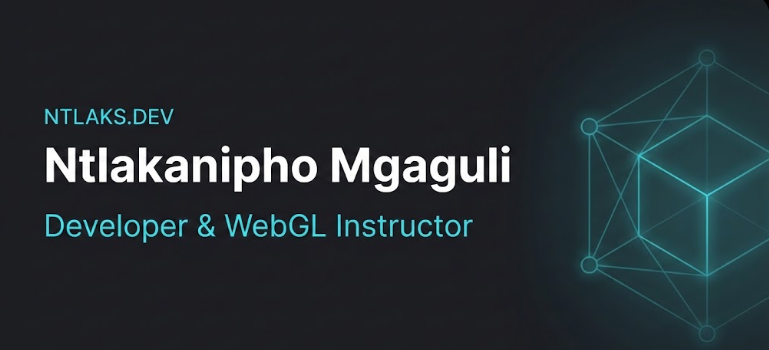

# Ntlaks Portfolio



Live site: [ntlaks.dev](https://ntlaks.dev)

Portfolio website for **Ntlakanipho Mgaguli**: Computer Engineering student, WebGL instructor, and tutor based in Cape Town, South Africa.

## Features
- Interactive WebGL hero experience.
- MDX-powered in-site blog (`/blog`, `/blog/:slug`).
- Responsive design with accessibility improvements.
- SEO metadata and structured data.
- Netlify Forms contact form with spam honeypot.

## Stack
- React 19
- Vite 7
- Tailwind CSS 4
- React Router
- MDX (`@mdx-js/rollup`, `@mdx-js/react`)
- Rehype Pretty Code + Shiki
- Netlify deployment

## Quick Start
```bash
npm install
npm run dev
npm run build
npm run preview
```

## Routes
- `/` portfolio home
- `/blog` blog listing
- `/blog/:slug` MDX blog post

## MDX Blog
Blog posts live in `src/content/blog/*.mdx` and are loaded using `import.meta.glob`.

Read the full authoring guide:
- `docs/BLOG_AUTHORING.md`

## Project Structure
```txt
src/
  components/
    blog/
      BlogLayout.jsx
      BlogList.jsx
      BlogPost.jsx
      MDXComponents.jsx
  content/
    blog/
      hello-world.mdx
  pages/
    Home.jsx
    Blog.jsx
    BlogPostPage.jsx
    NotFoundPage.jsx
  webgl/
  types/
    mdx.d.ts
```

## Links
- Portfolio: [ntlaks.dev](https://ntlaks.dev)
- Udemy: [WebGL for Beginners](https://www.udemy.com/user/ntlakanipho-mgaguli/)
- GitHub: [@2Ntlaks](https://github.com/2Ntlaks)
- LinkedIn: [Ntlakanipho Mgaguli](https://www.linkedin.com/in/ntlakanipho-mgaguli-36a1ab319/)

## License
MIT