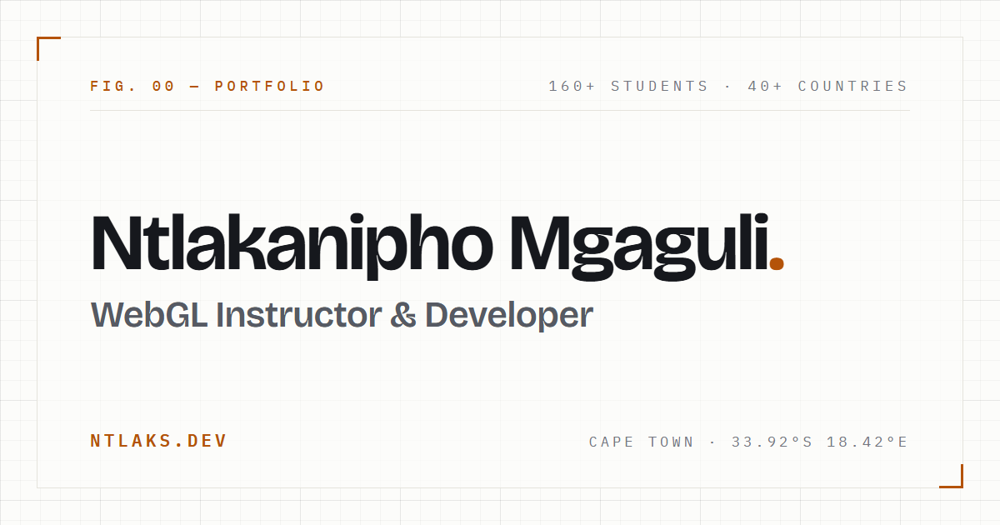

# Ntlaks Portfolio



Live site: [ntlaks.dev](https://ntlaks.dev)

Portfolio website for **Ntlakanipho Mgaguli**: Computer Engineering student, WebGL instructor, and tutor based in Cape Town, South Africa.

## Features
- Drafting-table design system: blueprint grid, plate-style project cards, "Fig." annotations.
- Interactive WebGL hero experience.
- Responsive design with accessibility improvements.
- SEO metadata and structured data.
- Email-first contact (no forms).

## Stack
- React 19
- Vite 7
- Tailwind CSS 4
- React Router
- Netlify deployment

## Quick Start
```bash
npm install
npm run dev
npm run build
npm run preview
```

## Links
- Portfolio: [ntlaks.dev](https://ntlaks.dev)
- Tutoring: [mgagulitutoring.dev](https://mgagulitutoring.dev)
- Blogs: [ntlaks.dev/writing](https://ntlaks.dev/writing)
- Udemy: [WebGL for Beginners](https://www.udemy.com/user/ntlakanipho-mgaguli/)
- GitHub: [@2Ntlaks](https://github.com/2Ntlaks)
- LinkedIn: [Ntlakanipho Mgaguli](https://www.linkedin.com/in/ntlakanipho-mgaguli-36a1ab319/)

## License
MIT
